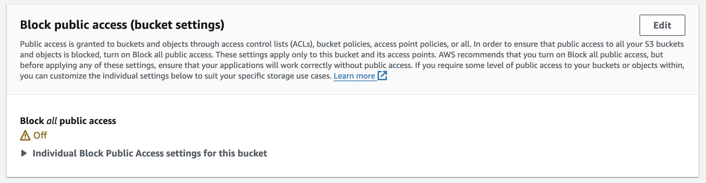
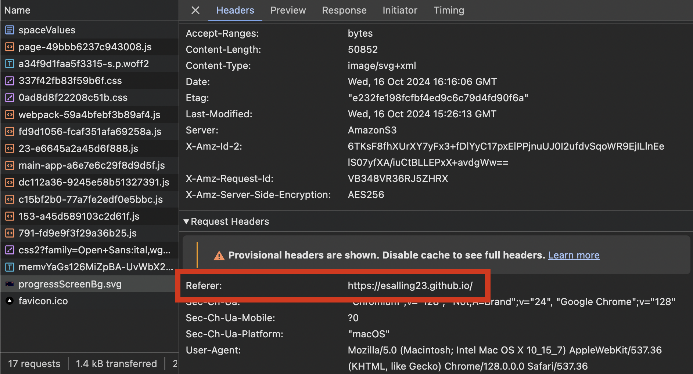

# S3 Protected Assets

For many of my work demos, I want to protect the assets used in the application but still have them usable on my own website. The following outlines how to use AWS S3 to manage asset access. 

## S3 Bucket

First, create a bucket. It should have "Block all public access" turned OFF.



---

## Bucket Policy

We'll create a bucket policy to protect our assets. 

### Referers

To allow access to our own websites using the assets, we will set an allowed set of "referers", which will be the websites from which we will request our assets. 

If anyone tries to request the assets from a location that is not one of the allowed referers, they will get a 403 error. For example, if someone inspects my app page & gets the URL of one of my assets, if they open it in a new tab or window etc. they will only see an error page, not my asset. 

### Policy Setup

Here's an example of how you could setup the bucket policy.

```
{
    "Version": "2012-10-17",
    "Statement": [
        {
            "Sid": "AllowSpecificReferer",
            "Effect": "Allow",
            "Principal": "*",
            "Action": "s3:GetObject",
            "Resource": "arn:aws:s3:::your-bucket-name/*",
            "Condition": {
                "StringLike": {
                    "aws:Referer": [
                        "https://yourwebsite.com/*",
                        "https://yourwebsite.com"
                    ]
                }
            }
        },
        {
            "Sid": "DenyAllOtherReferers",
            "Effect": "Deny",
            "Principal": "*",
            "Action": "s3:GetObject",
            "Resource": "arn:aws:s3:::your-bucket-name/*",
            "Condition": {
                "StringNotLike": {
                    "aws:Referer": [
                        "https://yourwebsite.com/*",
                        "https://yourwebsite.com"
                    ]
                }
            }
        }
    ]
}
```

#### Debugging Referer Policy

See [this question/answer](https://stackoverflow.com/a/47314087/15835070) about how to format your referer URLs. 

You can check what the correct referer domain of your site is by inspecting your application's network tab. Locate an asset that is being fetched and look at the Request Headers to find the referer domain data. 





